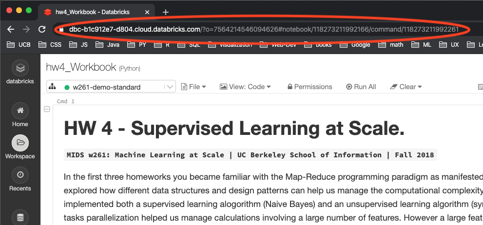

Homework 4: Gradient Descent at Scale
=====================================

In this homework you will perform distributed linear regression in Spark and
delve into the effects of different kinds of regularization.

### How to submit your work:

Please submit a link to your notebook in Databricks via the homework submission
form.

### Tips:

-   Make use of your peers and TAs by asking questions on Slack. Everyone comes
    to MIDs from a different background so don't be shy; all questions are
    welcome!
