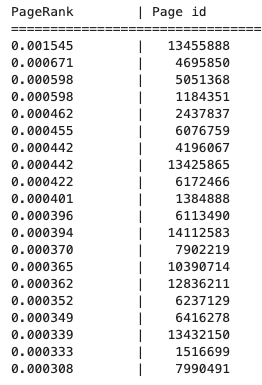
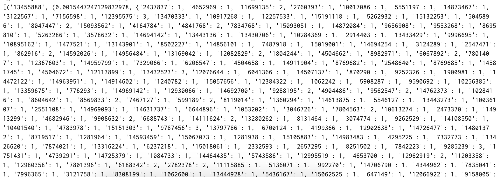

# Homework 5: Distributed Graph Processing 

In this homework you will implement Page Rank on data from a subset of the Wikipedia hyperlink graph. 

### Due date:
HW 5 due Friday Nov 6th midnight PST for all sections. The ususal 2 day grace period is applicable. Solutions will be released on Monday the 9th.

### How to submit your work:
You will submit a link to your notebook in databricks via the usual form.

### Reporting results:
* Your output must be human legible. Below is an example, of what is and isn't accpetable:

YES!   

DO NOT DO THIS (You wouldn't want to have to read this either, so don't do it):   

